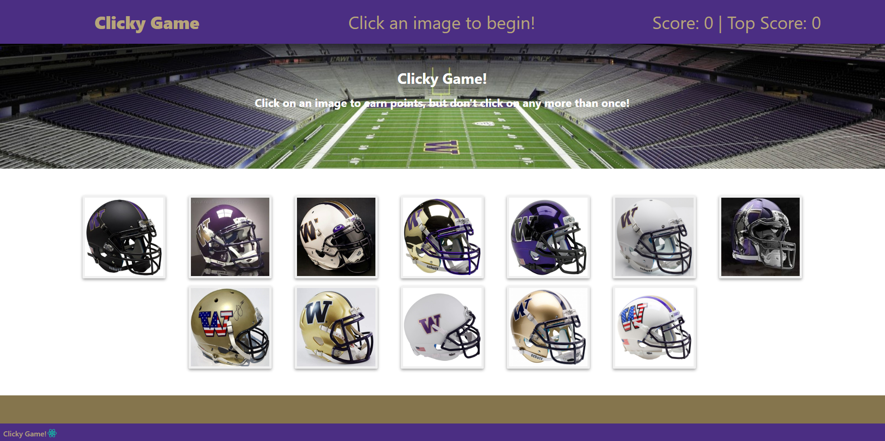
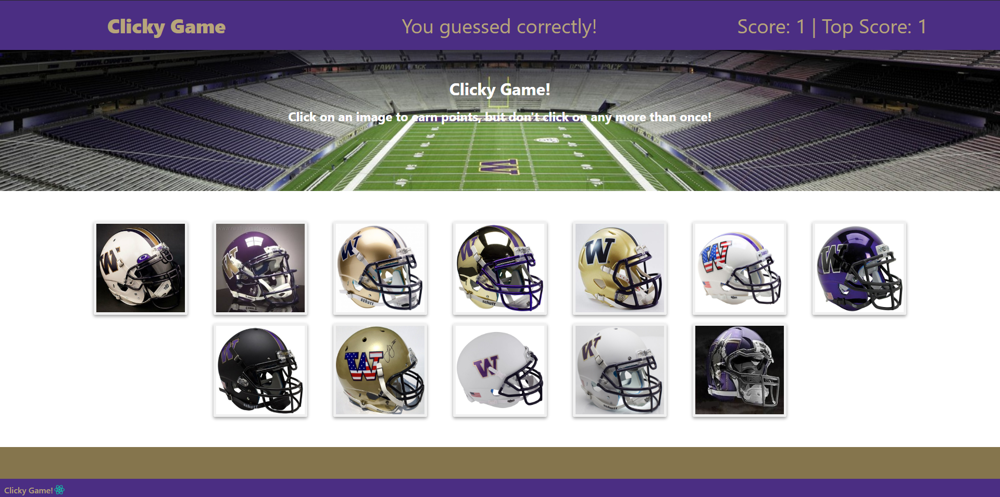
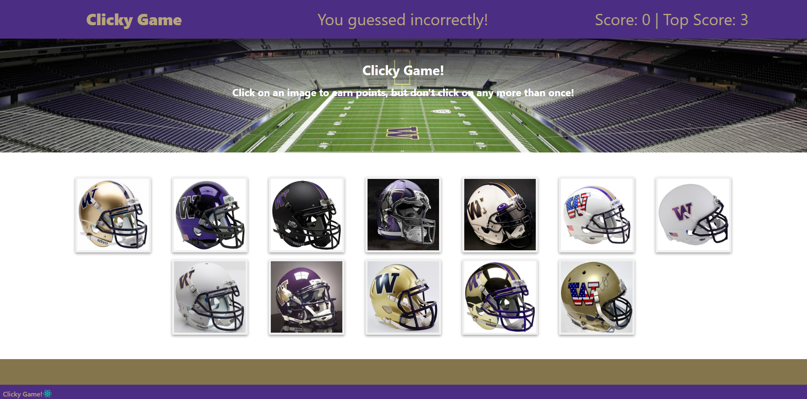

# ClickyGame

Hosted on Heroku: https://clickygame-h.herokuapp.com/

## Description

A memory game built with React.

* Goal is to click on each helmet only once until you reach a score of 12.
* The score will increase after every click and the helmets will shuffle to a new position.
* If you choose a helmet that was already chosen then you lose. A message will display at the top and the score will reset to 0. 
* You win once you've clicked all 12 helmets without choosing a duplicate.

## Screenshots

### Clicky Game home page

### Guessed right

### Guessed wrong

### Win and game reset

## Technologies Used

* `React`
* `Node`
* `Javascript`
* `HTML`
* `CSS`
